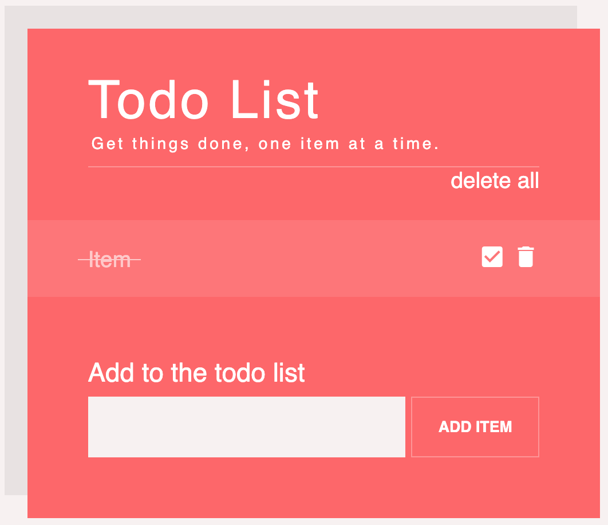

# DOM-Todo
In this lab you will create a todo list by manipulating the DOM. Checkout this helpful [link](https://www.w3schools.com/js/js_htmldom_document.asp)



## Code
All code will be written in **main.js**. Styling can be found in main.css. And Html is in index.html.

Your job is to complete all functions in main.js

`var toggleCheckbox = function(itemIndex){
  //should control the check boxes, and strikethrough syling for the list item
}`

`var deleteItem = function(itemIndex){
  //should delete an item in the list given it's index
}`

`var deleteAll = function(){
  //should delete all elements in the list using a loop
}`

`var addNewItem = function(){
  //should add an item to the list in it's default state
}`

At the end of the lab you should be able to 
1. Add items to the list by the add item button (create a new element that matches the default item in the list to start)
2. Check off items using the given checkbox (strikethrough should also appear on item)
3. Delete item given it's trash can
4. Delete all items via delete all

## List Item states.
In order to correctly change the states of list items and buttons you must manipulate the Elements classes.

**A default list item** looks like this in html
```
<li id="todoItem" class="todoItem">
  <span class="label">testi</span>
  <div>
    <button class="btn-picto" type="button">
      <i class="material-icons">check_box_outline_blank</i>
    </button>
    <button class="btn-picto" type="button">
      <i class="material-icons">delete</i>
    </button>
  </div>
</li>
```

**A completed list item** looks like this in html
```
<li id="todoItem" class="done todoItem">
  <span class="label">Item</span>
  <div class="actions">
    <button class="btn-picto" type="button">
      <i aria-hidden="true" class="material-icons" onclick="toggleCheckbox(0)">check_box</i>
    </button>
    <button class="btn-picto" type="button" aria-label="Delete" title="Delete">
      <i aria-hidden="true" class="material-icons" onclick="deleteItem(0)">delete</i>
    </button>
  </div>
</li>
```
Notice all html elements and classes. They are improtant since you will be creating them programmatically in methods like addItem(). And editing them in other like toggleCheckbox()


